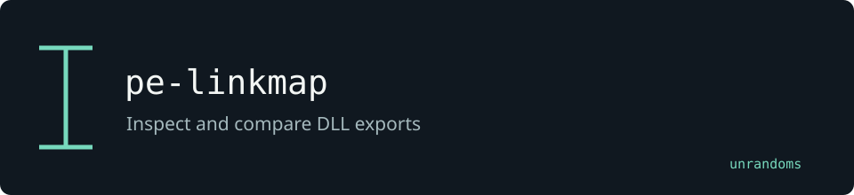

# dll-proxy-gen



A command-line tool that reads the export table of any Windows DLL and
generates ready-to-compile C source, a `.def` module-definition file, and an
optional `CMakeLists.txt` for building a **proxy DLL** that forwards every
call to the original while executing a payload on load.

> **Legal notice** — This tool is intended exclusively for authorised security
> testing, red-team exercises, and academic research on systems you own or have
> written permission to test.  Misuse against systems without authorisation
> is illegal.  The authors accept no liability for unlawful use.

---

## What is DLL proxying?

Windows resolves DLL imports by searching a set of directories in a fixed
order (the *DLL search order*).  If an application loads `version.dll`
without a full path, Windows looks in the application directory first.
Placing a crafted `version.dll` there — one that loads the real DLL and
forwards all calls — lets an attacker or red-teamer run arbitrary code in the
application's process.

### When it applies

| Condition | Detail |
|-----------|--------|
| DLL not in `KnownDLLs` | `HKLM\SYSTEM\CurrentControlSet\Control\Session Manager\KnownDLLs` lists DLLs always loaded from `System32`; these cannot be hijacked via the search order. |
| Application directory writable | The attacker must be able to place a file next to the `.exe`. |
| Manifest / side-by-side absent | WinSxS assemblies ignore the normal search order. |

Common hijackable targets: **version.dll**, **winmm.dll**, **dwmapi.dll**,
**uxtheme.dll**, **wtsapi32.dll**.

---

## Installation

```bash
pip install dll-proxy-gen          # from PyPI (once released)
# or directly from source
pip install .
```

Optional dependency for faster/more robust PE parsing:

```bash
pip install "dll-proxy-gen[pefile]"
```

The tool ships a pure-Python PE parser and falls back to it when `pefile` is
not installed.

---

## Usage

### List exports only

```bash
dll-proxy-gen --list-exports version.dll
```

```
DLL name  : version.dll
Ordinal base: 1
Total exports: 17
  Named       : 17
  Ordinal-only: 0

 Ordinal         RVA  Name
-------------------------------------------
       1  0x000015a0  GetFileVersionInfoA
       2  0x00001670  GetFileVersionInfoExA
       ...
```

### Generate a proxy with no payload

```bash
dll-proxy-gen --target version.dll --output ./proxy/
```

### Generate a proxy that shows a MessageBox on load

```bash
dll-proxy-gen --target winmm.dll --output ./winmm_proxy/ --payload messagebox
```

### Generate a proxy that runs shellcode from a binary file

```bash
dll-proxy-gen --target dwmapi.dll --output ./dwmapi_proxy/ \
              --payload shellcode --shellcode-file calc.bin
```

### Skip CMakeLists.txt

```bash
dll-proxy-gen --target version.dll --output ./proxy/ --no-cmake
```

---

## Generated files

| File | Purpose |
|------|---------|
| `proxy.c` | C source with `DllMain` and `#pragma comment(linker, "/export:...")` forwarding stubs |
| `proxy.def` | Module-definition file for explicit linker control |
| `CMakeLists.txt` | CMake build script for MSVC or MinGW |
| `shellcode.h` | *(shellcode payload only)* embedded byte array |

---

## Compiling the proxy

### MSVC (x64, Visual Studio command prompt)

```cmd
cl /LD /Fe:version.dll proxy.c /DEF:proxy.def
```

Or with CMake:

```cmd
cmake -B build -G "Visual Studio 17 2022" -A x64
cmake --build build --config Release
```

### MinGW-w64 (cross-compile from Linux or native Windows)

```bash
x86_64-w64-mingw32-gcc -shared -o version.dll proxy.c -Wl,--kill-at
```

Or with CMake:

```bash
cmake -B build -G "MinGW Makefiles" \
      -DCMAKE_C_COMPILER=x86_64-w64-mingw32-gcc \
      -DCMAKE_BUILD_TYPE=Release
cmake --build build
```

---

## Deployment steps

1. **Rename** the real `version.dll` to `_version_orig.dll` (the forwarding
   stubs reference this name).
2. **Place** your compiled `version.dll` and `_version_orig.dll` in the
   application directory.
3. **Launch** the target application; Windows loads your proxy, which loads
   the original and forwards all calls.

---

## Payload options

| `--payload` | Effect |
|-------------|--------|
| `none` (default) | Pure forwarding proxy — no extra code runs |
| `messagebox` | Calls `MessageBoxA` on load — useful for PoC verification |
| `shellcode` | Allocates RWX memory, copies shellcode bytes from `shellcode.h`, and executes in a new thread |
| `loadlib` | Calls `LoadLibraryA("payload.dll")` — load a separate stage |

---

## PE parser notes

`parser.py` reads the PE structure manually using Python's `struct` module:

1. DOS header (`MZ` magic, `e_lfanew`)
2. `IMAGE_NT_HEADERS` (PE signature + `IMAGE_FILE_HEADER`)
3. `IMAGE_OPTIONAL_HEADER` — both PE32 and PE32+ (64-bit) are supported
4. Section table — used to convert RVAs to file offsets
5. `IMAGE_EXPORT_DIRECTORY` — walks `AddressOfFunctions`,
   `AddressOfNames`, and `AddressOfNameOrdinals` to reconstruct named and
   ordinal-only exports

If `pefile` is installed (`pip install pefile`) it is used instead (faster,
handles edge cases in malformed headers).

---

## Project layout

```
dll-proxy-gen/
  dll_proxy_gen/
    __init__.py
    parser.py      # PE export table parser
    generator.py   # Jinja2-backed code generation
    payload.py     # payload snippet registry
    cli.py         # argparse CLI entry point
  templates/
    proxy.c.j2
    proxy.def.j2
    CMakeLists.txt.j2
  tests/
    test_parser.py
    test_generator.py
  pyproject.toml
  README.md
```

---

## License

MIT — see source headers.

## License and maintenance

Maintained by [unrandoms](https://github.com/unrandoms). Distributed under the [MIT License](LICENSE).
